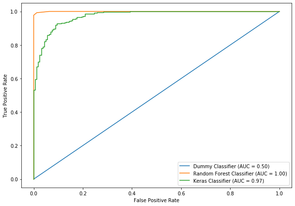
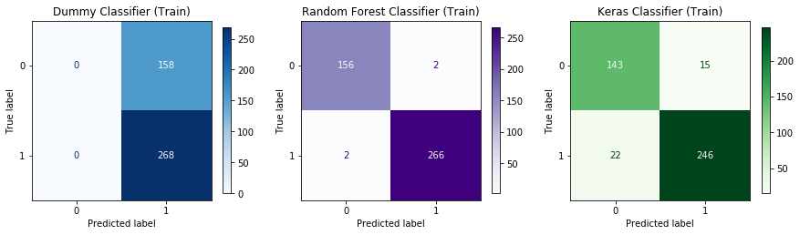
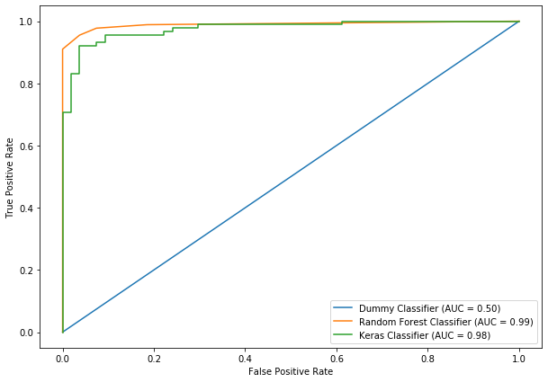
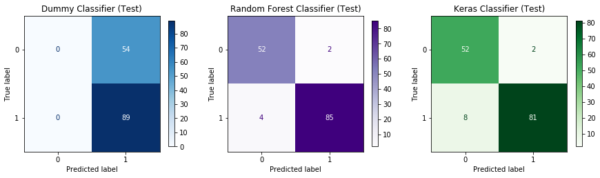

# `sklearn` Plotting Helpers

The file `plotting_helpers.py` contains two helper functions.  The goal is to emulate the ease-of-use of Scikit-learn's `metrics.plot_confusion_matrix` ([link to docs](https://scikit-learn.org/stable/modules/generated/sklearn.metrics.plot_confusion_matrix.html)) and `metrics.plot_roc_curve` ([link to docs](https://scikit-learn.org/stable/modules/generated/sklearn.metrics.plot_roc_curve.html))

The source code is heavily borrowed from [Scikit-learn's source code](https://github.com/scikit-learn/scikit-learn/), with some simplifications and other small changes to the interface.

Specific use cases for using these helpers rather than the Scikit-learn ones:

1. You need to use a version of Scikit-learn that is older than 0.22, when these functions were introduced
2. You are using the Keras Scikit-learn API ([link to docs](https://keras.io/scikit-learn-api/)), which is not compatible with these functions

This notebook will demonstrate using them with both Scikit-learn and Keras models

## Load Data


```python
import numpy as np
import pandas as pd

import matplotlib.pyplot as plt

from sklearn.datasets import load_breast_cancer
from sklearn.model_selection import train_test_split
from sklearn.preprocessing import StandardScaler
from sklearn.dummy import DummyClassifier
from sklearn.ensemble import RandomForestClassifier

import tensorflow as tf
from tensorflow.keras import Sequential
from tensorflow.keras.layers import Dense
from tensorflow.keras.wrappers.scikit_learn import KerasClassifier
tf.logging.set_verbosity(tf.logging.ERROR)

import plotting_helpers
```


```python
data = load_breast_cancer()
```


```python
X = pd.DataFrame(data["data"], columns=data["feature_names"])
y = pd.Series(data["target"])
```


```python
y.value_counts()
```


    1    357
    0    212
    dtype: int64


## Preprocess Data


```python
X_train, X_test, y_train, y_test = train_test_split(X, y, random_state=42)
```


```python
X_train.shape
```


    (426, 30)


```python
X_train.head()
```


<div>
<style scoped>
    .dataframe tbody tr th:only-of-type {
        vertical-align: middle;
    }

    .dataframe tbody tr th {
        vertical-align: top;
    }

    .dataframe thead th {
        text-align: right;
    }
</style>
<table border="1" class="dataframe">
  <thead>
    <tr style="text-align: right;">
      <th></th>
      <th>mean radius</th>
      <th>mean texture</th>
      <th>mean perimeter</th>
      <th>mean area</th>
      <th>mean smoothness</th>
      <th>mean compactness</th>
      <th>mean concavity</th>
      <th>mean concave points</th>
      <th>mean symmetry</th>
      <th>mean fractal dimension</th>
      <th>...</th>
      <th>worst radius</th>
      <th>worst texture</th>
      <th>worst perimeter</th>
      <th>worst area</th>
      <th>worst smoothness</th>
      <th>worst compactness</th>
      <th>worst concavity</th>
      <th>worst concave points</th>
      <th>worst symmetry</th>
      <th>worst fractal dimension</th>
    </tr>
  </thead>
  <tbody>
    <tr>
      <th>287</th>
      <td>12.89</td>
      <td>13.12</td>
      <td>81.89</td>
      <td>515.9</td>
      <td>0.06955</td>
      <td>0.03729</td>
      <td>0.02260</td>
      <td>0.01171</td>
      <td>0.1337</td>
      <td>0.05581</td>
      <td>...</td>
      <td>13.62</td>
      <td>15.54</td>
      <td>87.40</td>
      <td>577.0</td>
      <td>0.09616</td>
      <td>0.1147</td>
      <td>0.1186</td>
      <td>0.05366</td>
      <td>0.2309</td>
      <td>0.06915</td>
    </tr>
    <tr>
      <th>512</th>
      <td>13.40</td>
      <td>20.52</td>
      <td>88.64</td>
      <td>556.7</td>
      <td>0.11060</td>
      <td>0.14690</td>
      <td>0.14450</td>
      <td>0.08172</td>
      <td>0.2116</td>
      <td>0.07325</td>
      <td>...</td>
      <td>16.41</td>
      <td>29.66</td>
      <td>113.30</td>
      <td>844.4</td>
      <td>0.15740</td>
      <td>0.3856</td>
      <td>0.5106</td>
      <td>0.20510</td>
      <td>0.3585</td>
      <td>0.11090</td>
    </tr>
    <tr>
      <th>402</th>
      <td>12.96</td>
      <td>18.29</td>
      <td>84.18</td>
      <td>525.2</td>
      <td>0.07351</td>
      <td>0.07899</td>
      <td>0.04057</td>
      <td>0.01883</td>
      <td>0.1874</td>
      <td>0.05899</td>
      <td>...</td>
      <td>14.13</td>
      <td>24.61</td>
      <td>96.31</td>
      <td>621.9</td>
      <td>0.09329</td>
      <td>0.2318</td>
      <td>0.1604</td>
      <td>0.06608</td>
      <td>0.3207</td>
      <td>0.07247</td>
    </tr>
    <tr>
      <th>446</th>
      <td>17.75</td>
      <td>28.03</td>
      <td>117.30</td>
      <td>981.6</td>
      <td>0.09997</td>
      <td>0.13140</td>
      <td>0.16980</td>
      <td>0.08293</td>
      <td>0.1713</td>
      <td>0.05916</td>
      <td>...</td>
      <td>21.53</td>
      <td>38.54</td>
      <td>145.40</td>
      <td>1437.0</td>
      <td>0.14010</td>
      <td>0.3762</td>
      <td>0.6399</td>
      <td>0.19700</td>
      <td>0.2972</td>
      <td>0.09075</td>
    </tr>
    <tr>
      <th>210</th>
      <td>20.58</td>
      <td>22.14</td>
      <td>134.70</td>
      <td>1290.0</td>
      <td>0.09090</td>
      <td>0.13480</td>
      <td>0.16400</td>
      <td>0.09561</td>
      <td>0.1765</td>
      <td>0.05024</td>
      <td>...</td>
      <td>23.24</td>
      <td>27.84</td>
      <td>158.30</td>
      <td>1656.0</td>
      <td>0.11780</td>
      <td>0.2920</td>
      <td>0.3861</td>
      <td>0.19200</td>
      <td>0.2909</td>
      <td>0.05865</td>
    </tr>
  </tbody>
</table>
<p>5 rows × 30 columns</p>
</div>


```python
scaler = StandardScaler()
X_train_scaled = scaler.fit_transform(X_train)
X_test_scaled = scaler.transform(X_test)
```

# Build Models


```python
dummy_model = DummyClassifier(strategy="most_frequent")
rfc = RandomForestClassifier(random_state=42, n_estimators=5, max_depth=10)
```


```python
def create_nn_model():
    model = Sequential()
    model.add(Dense(10, activation='relu', input_shape=(30,)))
    model.add(Dense(5, activation='relu'))
    model.add(Dense(1, activation='linear'))
    model.compile(optimizer='adam', loss="binary_crossentropy", metrics=['accuracy']) 
    return model

nn = KerasClassifier(create_nn_model, epochs=10, batch_size=50, verbose=0)
```

## Fit Models on Training Data


```python
dummy_model.fit(X_train, y_train)
rfc.fit(X_train, y_train)
nn.fit(X_train_scaled, y_train)
```


    <tensorflow.python.keras.callbacks.History at 0x127f1d7b8>


## Show Model Performance on Training Data

### Train ROC curves


```python
fig, ax = plt.subplots(figsize=(10, 7))

plotting_helpers.plot_roc_curve_custom(dummy_model, X_train, y_train, "Dummy Classifier", ax)
plotting_helpers.plot_roc_curve_custom(rfc, X_train, y_train, "Random Forest Classifier", ax)
plotting_helpers.plot_roc_curve_custom(nn, X_train_scaled, y_train, "Keras Classifier", ax)
```





### Train Confusion Matrices


```python
fig, axes = plt.subplots(figsize=(15, 5), ncols=3)

plotting_helpers.plot_confusion_matrix_custom(
    dummy_model, X_train, y_train, 
    "Dummy Classifier (Train)", axes[0], cmap="Blues")
plotting_helpers.plot_confusion_matrix_custom(
    rfc, X_train, y_train, 
    "Random Forest Classifier (Train)", axes[1], cmap="Purples")
plotting_helpers.plot_confusion_matrix_custom(
    nn, X_train_scaled, y_train, 
    "Keras Classifier (Train)", axes[2], cmap="Greens")
```





## Show Model Performance on Test Data

(Obviously this is skipping to the end of a modeling process)

### Test ROC Curves


```python
fig, ax = plt.subplots(figsize=(10, 7))

plotting_helpers.plot_roc_curve_custom(dummy_model, X_test, y_test, "Dummy Classifier", ax)
plotting_helpers.plot_roc_curve_custom(rfc, X_test, y_test, "Random Forest Classifier", ax)
plotting_helpers.plot_roc_curve_custom(nn, X_test_scaled, y_test, "Keras Classifier", ax)
```





### Test Confusion Matrics


```python
fig, axes = plt.subplots(figsize=(15, 5), ncols=3)

plotting_helpers.plot_confusion_matrix_custom(
    dummy_model, X_test, y_test, 
    "Dummy Classifier (Test)", axes[0], cmap="Blues")
plotting_helpers.plot_confusion_matrix_custom(
    rfc, X_test, y_test, 
    "Random Forest Classifier (Test)", axes[1], cmap="Purples")
plotting_helpers.plot_confusion_matrix_custom(
    nn, X_test_scaled, y_test, 
    "Keras Classifier (Test)", axes[2], cmap="Greens")
```





```python

```
